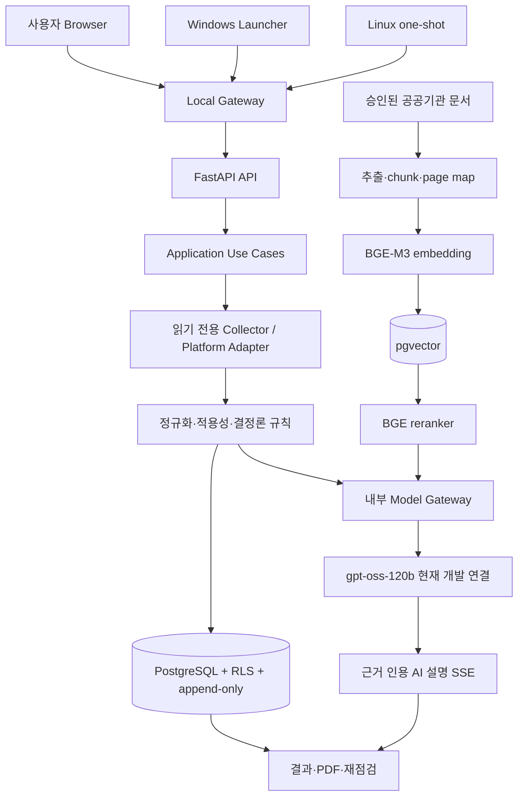

# Sec_AI 오픈소스 개발대회 결과보고서·SBOM·AI 모델 활용 명세

> 작성 기준일: 2026-08-07
> 프로젝트 버전: `secai-security-audit 0.1.0`
> 문서 성격: 심사요건 사진 1~3을 기준으로 사진 4~8 양식을 채운 **제출 초안**
> 기능 상태 정본: [`../../구현_현황.md`](../../구현_현황.md)

이 문서는 그대로 복사해 제출 양식에 옮길 수 있도록 작성했습니다. 다만 저장소에서 확인할 수 없는
팀 정보·공개 URL은 임의로 만들지 않았고, 현재 오픈소스 제출을 막는 라이선스 문제도 숨기지
않았습니다. 대괄호로 표시된 항목은 제출 전 실제 정보로 교체해야 합니다.

## 0. 제출 전 반드시 확정할 항목

### 0.1 참가팀이 입력해야 하는 값

| 항목                       | 제출값                                                         |
| -------------------------- | -------------------------------------------------------------- |
| 팀명                       | `[제출 전 입력: 참가 접수 정보와 동일한 팀명]`               |
| 팀 인원                    | `[제출 전 입력: 팀장 포함 N명]`                              |
| 참가 부문                  | `[제출 전 선택: 학생 / 일반]`                                |
| 과제 유형                  | `[제출 전 선택: 자유과제 / 지정과제(기업명)]`                |
| 공개 저장소 URL            | `[제출 전 입력: 공개 GitHub 또는 GitLab 저장소 URL]`         |
| 시연 영상 URL              | `[제출 전 입력: 공개 또는 심사위원 열람 가능한 YouTube URL]` |
| 팀원별 역할                | `[제출 전 입력: 이름·역할·기여 범위]`                      |
| 상용 AI 보조도구 기여 비율 | `[제출 전 입력: 실제 작업 기록을 근거로 산정]`               |

### 0.2 현재 상태에서의 제출 차단 사항

다음 항목은 문구 수정이 아니라 실제 저장소와 배포물의 조치가 선행되어야 합니다.

1. **프로젝트 자체가 아직 오픈소스가 아닙니다.** `pyproject.toml`은 현재
   `LicenseRef-Proprietary`이고 루트 `LICENSE` 파일도 없습니다. 저작권자가 OSI 승인 라이선스를
   선택하고 `LICENSE`, `NOTICE`, 소스 헤더·패키지 메타데이터를 일치시켜야 합니다. 특허 조항까지
   명확히 하려면 `Apache-2.0`을 우선 검토할 수 있으나, 최종 선택은 저작권자의 명시 승인이
   필요합니다.
2. **PyMuPDF 1.28.0은 AGPL 또는 상용 라이선스 대상입니다.** 공개 웹 서비스·배포 형태가 AGPL
   의무를 충족하는지 법률·라이선스 검토를 완료하거나, 허용되는 상용 라이선스를 확보하거나,
   permissive license PDF parser로 교체해야 합니다.
3. **Redis Server 8.8.0은 OSI 오픈소스 라이선스가 아닌 RSALv2로 잠겨 있습니다.** 현재는 내부
   Celery broker로만 사용하고 재판매·재배포를 금지했지만, 대회 공개 배포본은 Valkey 등 OSI
   라이선스 대체재 전환을 우선 검토해야 합니다. Python client `redis-py`는 별도 MIT입니다.
4. **MinIO AIStor Free는 별도 Free Tier 계약 제품입니다.** 현재 내부 단일 노드 개발용이며
   공개 소스 배포물에 포함하거나 재배포하지 않습니다. S3 호환 오픈소스 저장소 대체 또는
   사용자가 제공하는 외부 저장소 방식으로 분리해야 합니다.
5. **공공기관 원본 PDF는 공개 저장소에 재배포할 수 없습니다.** 현재 Catalog는 내부 검색·파생
   text·embedding만 승인하며 `redistribution_allowed=false`입니다. 공개 저장소에는 원본 PDF 대신
   공식 다운로드 URL, SHA-256, 페이지 맵 생성 방법과 사용자가 직접 내려받는 적재 절차만
   제공해야 합니다.
6. **공개 저장소 이력과 협업 근거를 아직 확인할 수 없습니다.** 현재 작업 폴더의 `.git`은 정상
   Git 저장소로 인식되지 않았습니다. 제출 전 공개 저장소에서 Issue·Pull Request·Review·Commit·
   Release·Contributor 기록을 실제 수치로 확인해야 합니다.

---

# 1. 심사요건 대응 요약

## 1.1 1차 서면평가 30점 대응

| 평가 기준                         | 보고서에서 강조할 내용                                                                                                              | 제출 증거                                                                                         |
| --------------------------------- | ----------------------------------------------------------------------------------------------------------------------------------- | ------------------------------------------------------------------------------------------------- |
| 프로젝트 구조 및 코드 완성도 6점  | API·application·collector·rule·persistence 계층 분리, 외부 DTO 검증, 고정 allowlist, 실패 시 차단, 테스트·타입·린트 Gate      | `apps/`, `src/security_audit/`, `collectors/`, `database/schemas/`, `tests/`, 잠금 파일 |
| 오픈소스 프로젝트 발전 가능성 6점 | 플랫폼 자동 식별 Catalog와 Adapter 구조, Audit Pack·가이드·모델 Gateway 교체 가능 구조, Windows·Linux·Switch로 검증한 확장 경로 | 자동 식별·플랫폼 확장 검증 기록, ADR 15~20, 로드맵                                               |
| 개발 문서의 구체성 6점            | 초보자 안내, 운영 안내, ADR, 유지보수, 파일 카탈로그, 실행 당시 검증 기록을 역할별 분리                                             | `README.md`, `docs/`, `deploy/verification/`, `AGENTS.md`                                 |
| 프로젝트 혁신성 6점               | 결정론 판정과 LLM 설명의 분리, 증적 hash·출처 페이지·append-only 결과, 선택 없는 플랫폼 식별, 오판정 방지                         | 결과 AI ADR, 플랫폼 resolver, 결과·AI 이력 복원 시험                                             |
| 프로젝트 팀워크 6점               | 역할 분담, Issue→Branch→PR→Review→Merge, 검증 기록과 변경 이유 보존                                                             | 공개 저장소의 실제 Issue·PR·Review·Commit 통계와 Contributors 화면                             |

## 1.2 2차 기능·라이선스 검증 대응

| 검증 항목         | 현재 준비 내용                                                                                                                | 남은 준비                                                                                                     |
| ----------------- | ----------------------------------------------------------------------------------------------------------------------------- | ------------------------------------------------------------------------------------------------------------- |
| 기능테스트 10점   | Windows·Linux·Aruba 읽기 전용 수집, 결과·PDF·AI 설명, 가이드 RAG, 취약점 후보 비교의 자동시험·실장비 일부 검증 기록 보유 | 심사용 clean 환경 설치, 실제 Windows/Linux VM 반복, 공개 demo 계정, 외부 AI 장애 시 동작 설명                 |
| 라이선스 검증 5점 | Python lock·container digest·검색 모델 revision/hash, SBOM·취약점 검사 기록, 비오픈소스 구성요소 분리 정책 보유            | 프로젝트 라이선스 확정, PyMuPDF·Redis·AIStor 조치, 원본 PDF 공개 저장소 제외, 최종 CycloneDX/SPDX SBOM 생성 |

---

# 2. 사진 4 — 결과보고서

## 2.1 기본 정보

| 항목      | 내용                                            |
| --------- | ----------------------------------------------- |
| 팀명      | `[제출 전 입력]`                              |
| 팀 인원   | `[제출 전 입력: 팀장 포함 N명]`               |
| 참가 부문 | `[제출 전 선택: 학생 / 일반]`                 |
| 과제 유형 | `[제출 전 선택: 자유과제 / 지정과제(기업명)]` |

## 2.2 프로젝트 개요

### 프로젝트명

**Sec_AI — 원클릭 멀티플랫폼 보안 점검과 근거 기반 AI 설명 플랫폼**

상장 표기용 이름은 참가 접수 정보와 정확히 맞추고, 특수문자 제한이 있으면 `Sec AI` 또는
`SecAI`로 통일합니다.

### 프로젝트 등록 URL

`[제출 전 입력: https://github.com/<organization-or-user>/<repository>]`

공개 저장소에는 최소한 다음 자료가 있어야 합니다.

- 프로젝트 자체 `LICENSE`, 제3자 고지 `THIRD_PARTY_NOTICES.md`, SBOM
- 5분 안에 실행 경로를 찾을 수 있는 루트 `README.md`
- `.env.example`과 secret을 제외한 재현 가능한 개발 환경
- Windows·Linux Collector build·hash 검증 절차
- 공공기관 PDF를 직접 재배포하지 않는 사용자 다운로드·적재 절차
- Issue·PR·Review·Release와 보안 취약점 제보 절차

### 시연 영상

`[제출 전 입력: https://youtu.be/<video-id>]`

권장 영상 구성은 다음과 같습니다.

1. 0:00~0:30 — 문제와 핵심 차별점
2. 0:30~1:10 — 아키텍처와 판정·AI 경계
3. 1:10~2:20 — Windows 원클릭 점검과 결과
4. 2:20~3:20 — Linux 자동 식별·중앙 SSH 또는 one-shot 점검
5. 3:20~4:10 — Aruba Switch 점검과 N-01~N-38 결과
6. 4:10~5:00 — 가이드 질의의 출처 페이지·LLM 스트림
7. 5:00~5:40 — 알려진 취약점 후보·공식 출처 한글 설명
8. 5:40~6:20 — 테스트·SBOM·라이선스·향후 로드맵

### 프로젝트 소개

Sec_AI는 Windows PC, Linux 서버, 네트워크 스위치의 보안 설정을 읽기 전용으로 수집하고,
승인된 기준과 결정론 규칙으로 점검 결과를 만든 뒤 그 결과를 공공기관 가이드 근거와 LLM으로
쉽게 설명하는 오픈소스 지향 보안 점검 플랫폼입니다. 사용자는 세부 OS·배포판을 직접 고르지
않아도 되며, 시스템이 지원 Catalog와 정확히 일치하는 장비만 자동 식별해 실행합니다.

핵심 원칙은 **“AI가 보안 판정을 만들거나 바꾸지 않는다”**입니다. 공식 상태는 수집 증적과
규칙 엔진이 만들고, AI는 실제 확인값·판정·출처 문단을 입력으로 받아 이유와 다음 행동을
설명합니다. 미지원 장비, 불완전 증적, 권한 부족, Feed 노후화는 양호로 추정하지 않고 차단·오류·
검토 필요로 구분합니다.

---

## 2.3 프로젝트 세부 내용

### 개발 배경 및 목적

기존 보안 점검은 명령어와 기준 문서를 이해해야 하고, Windows·Linux·Switch마다 도구와 결과
형식이 달라 초보자나 소규모 조직이 반복 수행하기 어렵습니다. 자동 스캐너는 빠르지만 수집 실패와
실제 취약 상태를 혼동하거나, 왜 문제가 되는지와 어느 공식 자료를 확인해야 하는지 설명하지 못하는
경우가 있습니다. 생성형 AI만으로 판정하면 같은 입력에도 결과가 달라질 수 있고 근거 없는 조치를
제안할 위험도 있습니다.

Sec_AI의 목표는 다음 네 가지입니다.

1. 사용자가 Windows·Linux·Switch의 큰 분류만 선택하면 세부 플랫폼은 시스템이 안전하게 식별합니다.
2. Collector는 설정을 바꾸지 않고 고정된 읽기 전용 명령·API만 실행합니다.
3. 보안 상태는 재현 가능한 규칙 엔진이 판정하고, LLM은 판정을 변경하지 않은 채 설명만 제공합니다.
4. 결과, 기준 snapshot, 증적 hash, AI 설명과 출처를 보존해 재점검과 검토가 가능하게 합니다.

현재 범위는 개발 환경 `LIVE`이며 Windows·Linux·Switch 판정은 운영 승인 전 `DRAFT`입니다.
운영 Finding, 자동 설정 변경, 무인 원격 조치는 의도적으로 제공하지 않습니다.

### 개발 환경

| 구분            | 사용 환경                                                                                                         |
| --------------- | ----------------------------------------------------------------------------------------------------------------- |
| Host            | Windows 개발 PC, Docker Desktop Linux engine, VMware 시험 VM                                                      |
| 서비스 Runtime  | CPython`3.14.6`, Docker `linux/amd64`                                                                         |
| Web/API         | FastAPI`0.139.2`, Uvicorn `0.51.0`, Jinja2 `3.1.6`, Nginx `1.30.4-alpine`                                 |
| 데이터베이스    | PostgreSQL`18.4`, pgvector `0.8.2`, Alembic `1.18.5`                                                        |
| Queue           | Celery`5.6.3`, Redis Python client `6.4.0`, Redis Server `8.8.0` 내부 broker                                |
| 객체 저장       | S3 호환 client`minio 7.2.20`; 현재 개발 저장소는 AIStor Free 단일 노드                                          |
| 검색 AI         | BGE-M3 1,024차원 embedding, BGE-reranker-v2-m3, TEI image digest 고정                                             |
| 생성 AI         | 내부 Model Gateway → 현재 OpenRouter의`openai/gpt-oss-120b`; 로컬 vLLM은 준비만 되었고 취약점 Gate로 실행 차단 |
| Collector build | PyInstaller`6.21.0`, Windows 10·11 x64, Linux x86_64 공용 실행파일                                             |
| 개발 언어       | Python, JavaScript, HTML/CSS, PowerShell, SQL, JSON/YAML                                                          |
| 품질 도구       | Pytest, Ruff, mypy strict,`node --check`, JSON Schema, pip-audit, Grype, ClamAV, Windows Defender, SBOM 도구    |

개발 의존성은 `requirements/*.in`에서 직접 의존성을 선언하고
`requirements/lock/*.lock`에 버전·hash를 고정합니다. 컨테이너는
[`../../deploy/locks/container-images.lock.yml`](../../deploy/locks/container-images.lock.yml),
검색 모델은
[`../../deploy/locks/search-models.lock.yml`](../../deploy/locks/search-models.lock.yml)에 digest·revision·
weight SHA-256을 기록합니다.

### 시스템 구성 및 아키텍처



구성요소별 역할은 다음과 같습니다.

| 계층             | 역할                                                             | 주요 위치                                            |
| ---------------- | ---------------------------------------------------------------- | ---------------------------------------------------- |
| Web/API          | 인증, CSRF, DTO, HTTP·SSE, 화면 응답                            | `apps/api/`, `apps/web/`                         |
| Application      | 점검·결과·AI·복구 유스케이스 조정                             | `src/security_audit/application/`                  |
| Collector        | Windows/Linux 읽기 전용 사실 수집, timeout·출력 상한·redaction | `src/security_audit/collector/`, `collectors/`   |
| Platform Adapter | Linux SSH, Aruba certificate-pinned REST GET                     | `src/security_audit/platforms/`                    |
| Analysis         | Package 검증, 정규화, 적용성, 규칙, Finding 경계                 | `src/security_audit/analysis/`                     |
| Guide/RAG        | Catalog, page map, 적재, embedding, 검색, citation               | `src/security_audit/guides/`, `guides/`          |
| AI Gateway       | OpenAI 호환 provider를 Core에서 격리, 모델·secret·timeout 통제 | `apps/model_gateway/`, `src/security_audit/llm/` |
| Persistence      | PostgreSQL repository, 조직·사용자 scope, RLS, append-only      | `src/security_audit/persistence/`, `database/`   |
| Audit Pack       | 판정 기준·Fixture·Adapter Catalog                              | `audit_packs/`                                     |

신뢰 경계는 다음과 같이 고정합니다.

- Collector는 사용자 입력 shell, 임의 REST path, raw SQL을 실행하지 않습니다.
- 증적 Package 검증이 실패하면 정규화·규칙·결과 생성으로 넘기지 않습니다.
- 권한 부족·수집 실패·미지원 장비는 `FAIL`이나 `PASS`로 추정하지 않습니다.
- AI는 결과 상태, 기준 hash, Audit Pack, DB 판정 row를 수정할 권한이 없습니다.
- 외부 모델에는 비식별 구조화 결과와 검색된 공개 문단만 보내고 token·credential·원본 증적은 보내지 않습니다.
- HTML은 제한 Markdown 계약으로 렌더링하며 모델 출력을 `innerHTML`에 직접 삽입하지 않습니다.

### 프로젝트 주요 기능

#### 1) 로그인·계정·관리자 운영

- 가입 요청 → 관리자 승인 → 개발용 두 번째 인증 → session·CSRF·RBAC 흐름을 제공합니다.
- 비밀번호는 Argon2id로 검증하고, Browser에는 계정 존재 여부가 드러나지 않는 공통 오류를 사용합니다.
- Linux 중앙 점검 서버는 관리자만 등록할 수 있습니다. 관리자는 별칭·승인 IPv4·SSH port·점검용
  계정만 입력하고, 시스템이 서버별 Ed25519 key pair를 생성합니다.
- 공개키 설치 후 관리자가 별도 경로로 확인한 Ed25519 host key를 등록해야 연결하며, 개인키는 DB
  column에 넣지 않습니다.

현재 인증은 localhost 개발용입니다. 운영 OIDC/WebAuthn, 실제 hostname·TLS, 운영 KMS/HSM은
아직 승인되지 않았습니다.

#### 2) 세부 제품을 묻지 않는 플랫폼 자동 식별

- 사용자는 Windows, Linux, Switch 중 하나만 선택합니다.
- `PlatformFingerprint`와 exact Support Catalog가 OS 계열·버전·architecture·장비 식별값을 비교합니다.
- Windows 10·11 x64, Ubuntu 22.04·24.04, Debian 12, Rocky·AlmaLinux 9와 등록 Aruba
  AOS-CX 10.13 경로를 지원하며 RHEL 9는 공식 구독 image 인수 전 Pilot입니다.
- Windows Server/Domain Controller, Cisco, 불완전·충돌·다중 후보는 자동 fallback 없이 차단합니다.

이 구조는 새 플랫폼을 추가할 때 UI 분기를 늘리는 대신 `fingerprint → support catalog → adapter → pack/profile`을 등록하도록 설계되어 발전 가능성을 높입니다.

#### 3) Windows PC 원클릭 점검

- Windows 실행파일이 PC-01~PC-18의 읽기 전용 Probe를 실행합니다.
- 일반 권한 15개 Probe와 별도 동의가 필요한 관리자 5개 Probe를 분리합니다.
- 결과, 관리자 추가 결과, PDF, AI 종합·항목 설명, 재점검 비교와 알려진 취약점 후보 확인을 제공합니다.
- Launcher가 열리지 않았을 때 다운로드·파일 열기·연결 재확인·원클릭 화면 복귀 절차를 제공합니다.
- 현재 파일은 조직 Publisher가 아닌 개발용 `DEV-SIGNED-TEST`이며 clean Windows 반복 인수와
  SmartScreen 평판은 남아 있습니다.

#### 4) Linux 중앙 SSH 점검과 one-shot 점검

- 중앙 점검은 관리자가 등록한 서버에 공개키로 접속하고 `/etc/os-release`, `uname -m`을 독립
  확인한 뒤 고정 42개 읽기 전용 명령으로 U-01~U-67 자료를 수집합니다.
- 일반 사용자는 Linux 종류를 선택하지 않고 등록된 서버 별칭만 고릅니다.
- 개인 서버나 중앙 등록이 어려운 환경은 공용 x86_64 one-shot 파일을 서버 내부에서 실행합니다.
- one-shot은 온라인 제출과 네트워크 단절 환경의 오프라인 Package 업로드를 지원합니다.
- sudo가 필요한 추가 자료는 사전 설명·별도 동의·exact allowlist를 요구합니다.
- Package manifest·명령·원문·정규화 결과의 SHA-256과 서명을 검증하고 설정 diff 0을 시험합니다.

현재 Ubuntu 22.04·24.04, Debian 12, Rocky·AlmaLinux 9 중앙 경로는 활성화됐고 RHEL 9는
Pilot입니다. 조직용 release 서명, 운영 SSH key KMS, 권한 부족·timeout과 RHEL 실제 VM
반복시험은 남아 있습니다.

#### 5) Aruba 네트워크 스위치 점검

- Aruba AOS-CX 10.13에 인증서 고정 REST `GET`만 사용합니다.
- 18개 endpoint에서 수집한 사실을 KISA 네트워크 N-01~N-38 개발용 기준에 연결합니다.
- 자동 입증 가능한 항목만 PASS/FAIL로 만들고 조직 정책·외부 장비·미수집 정보는 `REVIEW` 또는
  `N/A`로 남겨 false PASS를 막습니다.
- 결과 카드, 사용자용·기술 검증용 PDF, 무결성 hash, 재점검, 사용자 승인형 AI 설명을 제공합니다.

Aruba 실제 VM 정상/취약 snapshot은 검증했지만 Cisco와 운영 승인 Pack·Finding은 아직 지원하지
않습니다.

#### 6) 결과·AI 설명·이력 보존

- Windows·Linux·Switch 결과를 플랫폼·날짜별로 통합 조회합니다.
- organization·owner scope를 API와 PostgreSQL RLS에서 모두 확인합니다.
- 결과·기준 snapshot·표시 설명·완성 AI 설명을 append-only version으로 저장합니다.
- 결과 화면을 다시 열면 기존 설명을 복원하며 모델을 자동으로 다시 호출하지 않습니다. 사용자가
  재생성 버튼을 누른 경우에만 새 설명을 만듭니다.
- LLM stream이 중단돼도 공식 판정은 그대로 유지되며, 완성되지 않은 출력은 완료 cache로 저장하지
  않습니다.

#### 7) 공공기관 가이드 통합 RAG 질의

- KISA 직접 판정 근거 1종과 국가사이버안보센터·KISA 등 보완 가이드 7종을 통합 검색합니다.
- PDF 원문을 페이지 단위로 추출하고, chunk에 기관·문서·version·page·topic·platform·hash metadata를
  보존합니다.
- BGE-M3 1,024차원 embedding으로 후보를 찾고 BGE reranker로 재정렬한 뒤 관련 문단만 LLM에
  전달합니다.
- 답변은 token stream으로 표시하고 인라인 번호와 실제 PDF 페이지·기관·문서를 함께 보여줍니다.
- 보완 가이드는 설명 근거이며 Windows·Linux·Switch의 공식 판정을 변경하지 않습니다.

#### 8) 알려진 취약점 후보 비교

- Windows OS·KB·설치 프로그램·AppX·Python·Node.js·Java inventory를 NVD·OSV 공개 자료와
  비교합니다.
- 같은 구성요소의 여러 식별자를 하나로 묶고 구성요소·CVE 검색과 플랫폼 필터를 제공합니다.
- 자동 비교가 불가능한 공급자·제품 매핑, 증적 부족, Feed 오류를 별도 제외 사유로 표시합니다.
- 공개 원문 설명은 NIST NVD 또는 OSV source record의 사실을 보존해 한글로 번역합니다.

이 기능은 “영향 가능성 후보”이며 제조사 확정, VEX, 조직 공식 Finding이 아닙니다. 후보가 없거나
Feed가 오래됐다고 안전을 확정하지 않습니다.

#### 9) 복구·공급망·검증 가능성

- PostgreSQL Outbox와 Redis/Celery redelivery를 멱등 결과 처리와 연결합니다.
- requirements lock hash, container digest, model revision·weight SHA-256을 고정합니다.
- Windows/Linux artifact는 pip-audit, Grype, ClamAV, Defender, self-check와 hash 동일성 검사를 거칩니다.
- 과거 실행 결과는 `deploy/verification/`에 날짜·명령·PASS/FAIL·잔여 Gate와 함께 append-only로
  보존합니다.

### 구동 및 시연 방법

#### 중앙 Web 시연

```powershell
powershell -NoProfile -ExecutionPolicy Bypass `
  -File .\tools\core.ps1 -Action Status

powershell -NoProfile -ExecutionPolicy Bypass `
  -File .\tools\core.ps1 -Action Health
```

1. Gateway가 안내하는 localhost 주소에 접속합니다.
2. 개발 계정으로 로그인하고 `원클릭 점검`에서 Windows·Linux·Switch를 선택합니다.
3. Windows는 다운로드한 실행파일을 열고, Linux 중앙 점검은 관리자가 미리 등록한 서버 별칭을
   선택하며, Switch는 등록 Aruba 장비에 대해 읽기 전용 점검을 시작합니다.
4. 결과·PDF·재점검·AI 설명과 `점검 결과` 통합 이력을 확인합니다.
5. `가이드 질의`에서 질문하고 답변 인용 번호와 기관·문서·페이지를 확인합니다.

#### Linux one-shot 시연

1. Web의 프로그램 다운로드에서 Linux 공용 x86_64 파일과 일회용 code를 받습니다.
2. VM에서 실행 권한을 부여하고 파일을 실행합니다.
3. 배포판 자동 식별, 고정 읽기 전용 명령, Package hash와 제출 결과를 확인합니다.
4. 네트워크 단절 시 offline Package를 다른 PC로 옮겨 로그인 화면에서 업로드합니다.

정확한 초보자 절차는
[`../guides/Windows_Linux_Switch_통합_점검_초보자_안내.md`](../guides/Windows_Linux_Switch_통합_점검_초보자_안내.md),
VM 절차는
[`../guides/Linux_원샷_VM_시험_안내.md`](../guides/Linux_원샷_VM_시험_안내.md)를 따릅니다.

### 테스트 방법과 현재 결과

표준 개발 Gate는 다음 명령입니다.

```powershell
powershell -NoProfile -ExecutionPolicy Bypass `
  -File .\tools\dev.ps1 -Action All
```

| 검증 영역       | 검증 내용                                                                     | 현재 근거                                               |
| --------------- | ----------------------------------------------------------------------------- | ------------------------------------------------------- |
| Schema·Package | valid/invalid JSON Schema, canonical JSON, hash·서명·replay·변조 차단      | `IMP008`~`IMP018` 검증 기록                         |
| Windows         | PC-01~18, 관리자 동의, Launcher, 진행·중단·결과·PDF·AI·재점검            | `IMP029`~`IMP043`, Windows 최신 검증 기록           |
| Linux           | one-shot 01~10, 자동 식별, online/offline, VM 결정론, 중앙 등록 RBAC          | `LIN_ONESHOT_*`, `AUTO_SELECT_01`, `LINUX_REG_01` |
| Switch          | Aruba 실제 VM 정상/취약 snapshot, 인증·인증서·timeout 차단, N-01~N-38       | `SWITCH_03`~`SWITCH_08`, `SWITCH_UI_01`~`03`   |
| Guide/RAG       | PDF hash·page map, pgvector scope, citation, prompt-injection·제한 Markdown | `IMP047`~`IMP053`, `PUBLIC_GUIDE_01_05`           |
| 알려진 취약점   | NVD·OSV cache, 구성요소 grouping, 제외 사유, 공식 출처 한글 설명             | `VULN_01`, `VULN_WIN_COMPONENT_01`~`04`           |
| 권한·저장      | session·CSRF·RBAC, owner/org RLS, append-only, queue·storage recovery      | `IMP044`~`IMP046`, 통합 이력 검증 기록              |
| 공급망          | lock hash, image digest, SBOM, 취약점·악성코드 검사, artifact self-check     | `PRODUCT_AI_09`, `WINDOWS_LINUX_02`                 |

가장 최근 상태 문서에는 Linux 등록·점검·관리자 RBAC 집중 24건, 플랫폼 확장 회귀 111건,
Windows hash 회귀 25건, Switch·Linux PDF 집중 37건, 통합 결과 이력 회귀 54건 등의 PASS가
기록되어 있습니다. 이 숫자는 실행 당시 증거이며 전체 제품 무결점이나 운영 승인을 의미하지
않습니다. 상세 명령과 잔여 Gate는 각
[`../../deploy/verification/`](../../deploy/verification/) 문서를 확인합니다.

#### 기능테스트 시 반드시 보여줄 실패 시나리오

정상 화면만 보여주기보다 다음 차단 동작을 함께 시연하면 설계 완성도를 설명하기 쉽습니다.

- 미지원 OS·architecture 또는 fingerprint 충돌 → 실행 차단
- Linux host key 불일치 → SSH 연결 차단
- Switch 인증서 fingerprint 불일치·잘못된 credential·timeout → 안전한 오류
- Package hash·서명·manifest 변조 → 결과 생성 차단
- 일반 권한으로 관리자 Probe 요청 → 동의·권한 없이는 실행하지 않음
- 외부 LLM 중단 → 공식 결과 유지, AI 설명만 재시도 가능
- 다른 사용자·조직의 결과 ID 요청 → API와 RLS에서 모두 거부

### 기대효과 및 활용 분야

1. **초보자 접근성** — 장비 세부 종류와 복잡한 명령을 직접 선택하지 않고 큰 장비 분류와 안전한
   실행 절차만 따라 점검할 수 있습니다.
2. **소규모 조직의 반복 점검** — 중앙 UI에서 여러 장비 결과를 같은 형식으로 보존하고 재점검 차이를
   확인할 수 있습니다.
3. **보안 담당자의 검토 효율** — 판정, 실제 확인값, 기준 hash, 공공기관 근거 페이지, AI 설명을 한
   화면에서 분리해 검토할 수 있습니다.
4. **교육·훈련** — 취약한 VM snapshot과 정상 snapshot을 반복해 설정 차이, false PASS 방지, 최소
   권한을 학습할 수 있습니다.
5. **오픈소스 확장** — 새 OS·스위치는 자동 식별 Catalog, 읽기 전용 Adapter, Audit Pack Fixture를
   독립적으로 추가할 수 있습니다.
6. **공급망 점검 기반** — SBOM, version·hash lock, 공개 취약점 후보 비교, artifact 서명·검사 절차를
   프로젝트 자체 개발 과정에 적용할 수 있습니다.

활용 대상은 개인 사용자, 학교 실습실, 스타트업·중소기업, 보안 교육기관, 공공기관의 개발·검증
환경입니다. 현재 DRAFT 판정을 규제 준수 증명이나 공식 보안 인증서로 사용해서는 안 됩니다.

### 프로젝트의 혁신성 및 차별성

| 차별점                  | 기존 방식의 한계                                  | Sec_AI 방식                                                          |
| ----------------------- | ------------------------------------------------- | -------------------------------------------------------------------- |
| 판정과 AI 분리          | LLM 답변이 곧 판정이면 재현성과 책임 경계가 약함  | 규칙 엔진이 상태를 만들고 LLM은 읽기 전용 설명만 생성                |
| 선택 없는 안전 식별     | 사용자가 잘못된 OS profile을 선택하면 오판정 가능 | exact fingerprint 불일치·충돌은 fallback 없이 차단                  |
| false PASS 방지         | 수집 실패·권한 부족을 취약/양호로 잘못 해석      | PASS/FAIL/ERROR/REVIEW/N/A와 적용성을 분리                           |
| 근거의 계보             | 결과 이유와 문서 페이지가 분리됨                  | 실제값·판정·기준 hash·문서·페이지·AI version 연결               |
| 재접속 비용·일관성     | 화면을 열 때마다 AI가 다시 생성됨                 | 완성 설명을 owner-scoped append-only cache로 복원, 버튼으로만 재생성 |
| 다중 장비 공통 UX       | 플랫폼별 도구·결과 형식이 다름                   | Windows·Linux·Switch 결과·PDF·AI·이력을 같은 흐름으로 제공      |
| 공개 자료의 보수적 사용 | CVE 후보를 곧바로 취약 확정으로 표시              | 영향 가능 후보, 자동 비교 제외, 공식 원문·한글 번역을 분리          |

### 한계점 및 향후 발전 로드맵

#### 제출 전 필수

1. 프로젝트 OSI 라이선스 확정과 `LICENSE`·`NOTICE`·package metadata 정합화
2. PyMuPDF AGPL 대응 또는 교체, Redis RSALv2·AIStor 비오픈소스 의존성 대체/분리
3. 공공기관 원본 PDF를 공개 저장소·Git history에서 제외하고 재다운로드 도구 제공
4. 최종 CycloneDX JSON·SPDX JSON SBOM과 라이선스 충돌 보고서 생성
5. clean PC에서 저장소 clone부터 실행까지 재현하고 영상으로 기록
6. 실제 공개 저장소 URL, release tag, commit SHA, demo URL, 팀 기여 통계 확정

#### 단기

1. clean Windows 10·11과 Linux 6종 정상/취약 VM 반복시험
2. Windows·Linux 조직용 서명, key rotation, artifact provenance와 SmartScreen Pilot
3. 관리자 계정에 OIDC/WebAuthn·TLS 적용, 운영 Backup·KMS·복구 인수
4. RAG 검색 품질 benchmark와 한국어 질문 세트 공개
5. Aruba 실장비 반복시험과 공식 Source Mapping·Audit Pack 승인

#### 중장기

1. Windows Server/DC, Cisco IOS XE 등 별도 기준·Adapter 확장
2. 취약점 후보에 vendor advisory·KEV·VEX·정확한 수정 버전 정책 추가
3. 취약점 Gate를 통과한 local vLLM profile과 외부 전송 0 검증
4. 커뮤니티가 새 Adapter·Pack을 제안할 수 있는 Schema validator와 fixture template 공개
5. 자동 조치가 아닌 승인형 조치 계획·변경 전후 diff·rollback 설계

---

# 3. 팀워크 작성안

심사표는 기능뿐 아니라 GitHub Issue·Review·Pull Request·Commit·Merge·커뮤니티 관리 수준을
평가합니다. 실제 공개 저장소 기록 없이 아래 수치를 채우면 안 됩니다.

## 3.1 역할 분담표

| 팀원            | 주 역할                | 세부 책임                             | 공개 근거           |
| --------------- | ---------------------- | ------------------------------------- | ------------------- |
| `[팀장 이름]` | Architecture·Security | ADR, 권한·판정 경계, release 승인    | `[PR/Issue 링크]` |
| `[팀원 이름]` | Collector·Platform    | Windows/Linux/Switch Adapter, VM 시험 | `[PR/Issue 링크]` |
| `[팀원 이름]` | Guide·AI              | RAG, model gateway, citation·안전성  | `[PR/Issue 링크]` |
| `[팀원 이름]` | Web·QA·Docs          | UI, 접근성, E2E, 사용자 문서·SBOM    | `[PR/Issue 링크]` |

팀 인원에 맞게 역할을 합치거나 행을 추가합니다. 한 사람이 여러 역할을 맡았다면 실제로 수행한
범위와 검토자를 분명히 씁니다.

## 3.2 협업 절차

```text
Issue 등록 → 범위·완료조건 합의 → 기능 branch → 실패 테스트/계약 추가
→ 최소 구현 → 자체 검사 → Pull Request → 다른 팀원 Review
→ 보안·라이선스·문서 확인 → Merge → 검증 기록·Release 갱신
```

## 3.3 제출 전 실제 통계 입력

| 지표                            | 실제 값     | 증거 URL  |
| ------------------------------- | ----------- | --------- |
| 전체 Issue / 완료 Issue         | `[N / N]` | `[URL]` |
| Pull Request / Merge            | `[N / N]` | `[URL]` |
| 다른 팀원 Review가 있는 PR      | `[N]`     | `[URL]` |
| Commit 수 / Contributors        | `[N / N]` | `[URL]` |
| Release 수                      | `[N]`     | `[URL]` |
| 버그·기능·문서·보안 label 수 | `[N]`     | `[URL]` |
| 외부 피드백·Discussion         | `[N]`     | `[URL]` |

권장 저장소 파일은 `CONTRIBUTING.md`, `CODE_OF_CONDUCT.md`, `SECURITY.md`, Issue/PR template,
roadmap과 changelog입니다. 현재 존재 여부를 확인하고 실제로 운영할 파일만 추가합니다.

---

# 4. 사진 7 — 붙임 1. SBOM(소프트웨어 자재명세서)

## 4.1 작성 기준

- 아래 표는 `requirements/*.in`, hash-pinned `requirements/lock/*.lock`, 실행 container metadata와
  container/model lock을 기준으로 한 **직접 의존성 중심 명세**입니다.
- transitive OS·Python package 전체 목록은 제출 release image와 Windows/Linux artifact에서 Syft 등으로
  다시 생성한 CycloneDX JSON·SPDX JSON을 정본으로 삼아야 합니다.
- `라이선스` 열의 `검토 필요`는 위반을 인정한다는 뜻이 아니라 배포 방식 확정 전 해결해야 할
  제출 Gate입니다.

## 4.2 Python·Collector 직접 의존성

| 번호 | 라이브러리명      | 버전                            | 라이선스                                        | 공식 저장소 URL                                                                                   | 사용 목적 및 주요 기능                                                     |
| ---: | ----------------- | ------------------------------- | ----------------------------------------------- | ------------------------------------------------------------------------------------------------- | -------------------------------------------------------------------------- |
|    1 | CPython           | 3.14.6                          | Python Software Foundation License              | [https://github.com/python/cpython](https://github.com/python/cpython)                             | API·Worker·Collector 실행 Runtime                                        |
|    2 | Alembic           | 1.18.5                          | MIT                                             | [https://github.com/sqlalchemy/alembic](https://github.com/sqlalchemy/alembic)                     | PostgreSQL schema migration                                                |
|    3 | argon2-cffi       | 25.1.0                          | MIT                                             | [https://github.com/hynek/argon2-cffi](https://github.com/hynek/argon2-cffi)                       | 사용자 비밀번호 Argon2id 검증                                              |
|    4 | FastAPI           | 0.139.2                         | MIT                                             | [https://github.com/fastapi/fastapi](https://github.com/fastapi/fastapi)                           | REST·SSE API와 입력 검증 진입점                                           |
|    5 | Jinja2            | 3.1.6                           | BSD                                             | [https://github.com/pallets/jinja](https://github.com/pallets/jinja)                               | Server-rendered Web template                                               |
|    6 | python-multipart  | 0.0.32                          | Apache-2.0                                      | [https://github.com/Kludex/python-multipart](https://github.com/Kludex/python-multipart)           | 로그인 form·허용된 파일 upload parsing                                    |
|    7 | Uvicorn           | 0.51.0                          | BSD-3-Clause                                    | [https://github.com/Kludex/uvicorn](https://github.com/Kludex/uvicorn)                             | ASGI server                                                                |
|    8 | cryptography      | 48.0.1 / Linux Collector 50.0.0 | Apache-2.0 OR BSD-3-Clause                      | [https://github.com/pyca/cryptography](https://github.com/pyca/cryptography)                       | 서명 검증, SSH·인증서·key 처리                                           |
|    9 | HTTPX             | 0.28.1                          | BSD-3-Clause                                    | [https://github.com/encode/httpx](https://github.com/encode/httpx)                                 | 내부 HTTP, Aruba REST, 공개 Feed client                                    |
|   10 | jsonschema        | 4.26.0                          | MIT                                             | [https://github.com/python-jsonschema/jsonschema](https://github.com/python-jsonschema/jsonschema) | Package·Manifest·결과 JSON Schema 검증                                   |
|   11 | minio Python SDK  | 7.2.20                          | Apache-2.0                                      | [https://github.com/minio/minio-py](https://github.com/minio/minio-py)                             | S3 호환 증적 객체 저장 client                                              |
|   12 | Psycopg 3         | 3.3.4                           | LGPL-3.0-only                                   | [https://github.com/psycopg/psycopg](https://github.com/psycopg/psycopg)                           | PostgreSQL·pgvector 접근                                                  |
|   13 | Pydantic          | 2.13.4                          | MIT                                             | [https://github.com/pydantic/pydantic](https://github.com/pydantic/pydantic)                       | 외부 DTO·설정·도메인 계약 검증                                           |
|   14 | pydantic-settings | 2.14.2                          | MIT                                             | [https://github.com/pydantic/pydantic-settings](https://github.com/pydantic/pydantic-settings)     | 환경 설정 parsing·validation                                              |
|   15 | redis-py          | 6.4.0                           | MIT                                             | [https://github.com/redis/redis-py](https://github.com/redis/redis-py)                             | Celery broker client; Redis Server 라이선스와 별개                         |
|   16 | rfc8785.py        | 0.1.4                           | Apache-2.0                                      | [https://github.com/trailofbits/rfc8785.py](https://github.com/trailofbits/rfc8785.py)             | RFC 8785 canonical JSON과 서명 payload 안정화                              |
|   17 | SQLAlchemy        | 2.0.51                          | MIT                                             | [https://github.com/sqlalchemy/sqlalchemy](https://github.com/sqlalchemy/sqlalchemy)               | DB transaction·repository 기반                                            |
|   18 | structlog         | 26.1.0                          | MIT OR Apache-2.0                               | [https://github.com/hynek/structlog](https://github.com/hynek/structlog)                           | 민감값을 제외한 구조화 감사·운영 로그                                     |
|   19 | Celery            | 5.6.3                           | BSD-3-Clause                                    | [https://github.com/celery/celery](https://github.com/celery/celery)                               | 비동기 작업·재시도·queue 처리                                            |
|   20 | LangGraph         | 1.2.9                           | MIT                                             | [https://github.com/langchain-ai/langgraph](https://github.com/langchain-ai/langgraph)             | 결정론 background workflow orchestration                                   |
|   21 | PyMuPDF           | 1.28.0                          | AGPL-3.0 또는 상용                              | [https://github.com/pymupdf/PyMuPDF](https://github.com/pymupdf/PyMuPDF)                           | 공공기관 PDF text·page metadata 추출;**제출 전 라이선스 해결 필수** |
|   22 | PyInstaller       | 6.21.0                          | GPL-2.0 + Bootloader exception; 일부 Apache-2.0 | [https://github.com/pyinstaller/pyinstaller](https://github.com/pyinstaller/pyinstaller)           | Windows/Linux Collector 단일 실행파일 build                                |

## 4.3 서비스·인프라·검사 구성요소

| 번호 | 구성요소                  | 버전·image                  | 라이선스                           | 공식 저장소·자료                                                                                                   | 사용 목적 및 배포 판단                                                             |
| ---: | ------------------------- | ---------------------------- | ---------------------------------- | ------------------------------------------------------------------------------------------------------------------- | ---------------------------------------------------------------------------------- |
|   23 | Nginx                     | 1.30.4-alpine                | BSD-2-Clause                       | [https://github.com/nginx/nginx](https://github.com/nginx/nginx)                                                     | localhost Gateway·정적 파일·API reverse proxy                                    |
|   24 | PostgreSQL                | 18.4                         | PostgreSQL License                 | [https://github.com/postgres/postgres](https://github.com/postgres/postgres)                                         | 결과·정책·감사·대화의 business truth                                            |
|   25 | pgvector                  | 0.8.2                        | PostgreSQL License                 | [https://github.com/pgvector/pgvector](https://github.com/pgvector/pgvector)                                         | 가이드 embedding 검색 projection                                                   |
|   26 | pgAdmin 4                 | 9.16                         | PostgreSQL License                 | [https://github.com/pgadmin-org/pgadmin4](https://github.com/pgadmin-org/pgadmin4)                                   | loopback 개발 관리자 profile 전용; 제품 필수 구성 아님                             |
|   27 | Redis Server              | 8.8.0                        | RSALv2, OSI 아님                   | [https://github.com/redis/redis](https://github.com/redis/redis)                                                     | 내부 Celery broker 전용;**공개 배포본은 대체/별도 동의 검토**                |
|   28 | ClamAV                    | 1.4.5                        | GPL-2.0                            | [https://github.com/Cisco-Talos/clamav](https://github.com/Cisco-Talos/clamav)                                       | upload·artifact 악성코드 검사                                                     |
|   29 | MinIO AIStor Free         | RELEASE.2026-06-06T02-44-06Z | AIStor Free Tier License Agreement | [https://www.min.io/aistor](https://www.min.io/aistor)                                                               | 내부 단일 노드 증적 저장; 재배포 금지, 공개 프로젝트에서는 외부/대체 저장소로 분리 |
|   30 | Text Embeddings Inference | image`86-1.8`, digest 고정 | Apache-2.0                         | [https://github.com/huggingface/text-embeddings-inference](https://github.com/huggingface/text-embeddings-inference) | BGE embedding·reranking model serving                                             |
|   31 | vLLM                      | 0.23.0 image 준비            | Apache-2.0                         | [https://github.com/vllm-project/vllm](https://github.com/vllm-project/vllm)                                         | 향후 local LLM; 현재 Critical/High Gate 실패로**실행 차단**                  |

## 4.4 개발·검증 도구

| 도구                | 고정 버전 또는 상태          | 목적                             | 배포 포함 여부                 |
| ------------------- | ---------------------------- | -------------------------------- | ------------------------------ |
| pytest              | 9.1.1                        | unit·contract·integration 시험 | 제품 Runtime 미포함            |
| Ruff                | 0.15.22                      | Python lint·보안 규칙           | 제품 Runtime 미포함            |
| mypy                | 1.20.2                       | strict type check                | 제품 Runtime 미포함            |
| pip-audit           | 2.10.1                       | Python 취약 의존성 검사          | 제품 Runtime 미포함            |
| Grype               | 검증 기록에 version·DB 기록 | container/artifact CVE scan      | 검사 도구, 제품 Runtime 미포함 |
| Syft 또는 동등 도구 | 제출 release에서 재실행      | CycloneDX·SPDX SBOM 생성        | 검사 도구, 제품 Runtime 미포함 |
| Windows Defender    | Host 제공                    | Windows 실행파일 악성코드 검사   | OS 기능                        |

## 4.5 라이선스 충돌·조치표

어려운 법률 용어보다 **“지금 무엇이 문제이고, 무엇을 하면 되는지”**만 정리하면 다음과 같습니다.

| 확인할 대상          | 쉽게 말하면                                                                                                                                | 가장 쉬운 해결 방법                                                                                                                                 | 중요도                   |
| -------------------- | ------------------------------------------------------------------------------------------------------------------------------------------ | --------------------------------------------------------------------------------------------------------------------------------------------------- | ------------------------ |
| Sec_AI 자체 라이선스 | 현재는 “우리 코드의 사용·수정·배포를 허용한다”는 오픈소스 허가서가 없습니다.                                                           | 팀이`Apache-2.0` 또는 `MIT` 중 하나를 결정한 뒤 `LICENSE`, `NOTICE`, `pyproject.toml`에 같은 내용을 적용합니다.                           | **제출 전 필수**   |
| PyMuPDF              | PDF를 읽는 라이브러리입니다. 현재 방식으로 공개하면 프로젝트 소스 공개 범위가 예상보다 넓어질 수 있습니다.                                 | 가장 간단한 방법은 대회 제출 전에 허용 조건이 단순한 PDF 라이브러리로 교체하는 것입니다. 계속 사용하려면 AGPL 준수 또는 상용 라이선스를 검토합니다. | **제출 전 필수**   |
| Redis Server         | 작업 대기열에 사용하는 서버입니다. 소스는 공개돼 있지만 일반적인 오픈소스 라이선스는 아닙니다.                                             | 호환 가능한 오픈소스`Valkey`로 교체하는 방법이 가장 이해하기 쉽습니다.                                                                            | **교체 권장**      |
| AIStor Free          | 점검 자료를 보관하는 저장소입니다. 프로그램에 포함해 다른 사람에게 나눠 주는 데 제한이 있습니다.                                           | 공개 배포 파일에서는 AIStor를 제외하고, 사용자가 자신의 S3 저장소를 연결하게 하거나 오픈소스 저장소로 교체합니다.                                   | **제출 전 확인**   |
| 공공기관 PDF         | KISA 등에서 받은 PDF를 Sec_AI 공개 저장소에 그대로 올릴 수 있는지는 별도 확인이 필요합니다.                                                | PDF 파일은 공개 저장소에서 제외하고 공식 다운로드 주소와 SHA-256만 제공합니다. 사용자가 실행한 설치 도구가 공식 사이트에서 직접 받도록 합니다.      | **제출 전 필수**   |
| AI 모델·OpenRouter  | AI 모델 자체의 사용 조건과 AI를 대신 실행해 주는 OpenRouter의 이용조건은 서로 다릅니다.                                                    | 사용 모델명·버전·라이선스, OpenRouter 사용 여부, 외부로 보내는 데이터 범위를 README에 공개합니다. 모델 파일은 저장소에 넣지 않습니다.             | **내용 공개 필수** |
| PyInstaller          | Python 프로그램을 Windows·Linux 실행파일로 만드는 도구입니다. 사용 자체는 가능하지만 함께 묶이는 라이브러리들의 라이선스도 지켜야 합니다. | PyInstaller를 직접 수정하지 않았는지 확인하고, 실행파일에 포함된 라이브러리 목록과 라이선스를 SBOM·고지문에 기록합니다.                            | **최종 빌드 확인** |

### 가장 먼저 처리할 세 가지

1. Sec_AI의 오픈소스 라이선스를 결정합니다.
2. PyMuPDF를 교체하거나 사용 조건을 확정합니다.
3. 공공기관 PDF 원본을 공개 저장소에서 제외합니다.

이 세 가지가 해결되지 않으면 다른 기능이 잘 작동하더라도 오픈소스·라이선스 심사에서 문제가
될 수 있습니다. Redis, AIStor, OpenRouter와 PyInstaller는 그다음에 교체 여부 또는 공개 범위를
정리하면 됩니다.

---

# 5. 사진 8 — 붙임 2. AI 모델 활용 및 라이선스 기술 명세서

## 5.1 AI 모델 활용 유형

- [X] **유형 1: 외부 모델 그대로 활용**
- [ ] 유형 2: 외부 모델 fine-tuning
- [ ] 유형 3: 자체 개발 모델 전체 학습

Sec_AI는 생성 LLM, embedding model, reranker를 추가 학습 없이 고정 revision 그대로 사용합니다.
프로젝트 가이드 문서를 vector로 변환하는 것은 inference이며 모델 fine-tuning이나 신규 weight 생성이
아닙니다.

## 5.2 기반 모델 정보

| 역할                     | 기반 모델·개발사                   | 사용 방식                                        | 라이선스                                                 | 고정 정보                                                                                                                                 |
| ------------------------ | ----------------------------------- | ------------------------------------------------ | -------------------------------------------------------- | ----------------------------------------------------------------------------------------------------------------------------------------- |
| 결과·가이드 설명 LLM    | `openai/gpt-oss-120b` · OpenAI   | 현재 OpenRouter 원격 API를 통한 Type 1 inference | Apache-2.0 + gpt-oss usage policy; OpenRouter terms 별도 | model ID 고정, local weight 미보유                                                                                                        |
| 한국어·다국어 embedding | `BAAI/bge-m3` · BAAI             | 내부 승인 문서·질문의 1,024차원 vector 생성     | MIT                                                      | revision`5617a9f61b028005a4858fdac845db406aefb181`; weight SHA-256 `b5e0ce3470abf5ef3831aa1bd5553b486803e83251590ab7ff35a117cf6aad38` |
| 검색 reranker            | `BAAI/bge-reranker-v2-m3` · BAAI | 검색 후보의 질문 관련도 재정렬                   | Apache-2.0                                               | revision`953dc6f6f85a1b2dbfca4c34a2796e7dde08d41e`; weight SHA-256 `d9e3e081faff1eefb84019509b2f5558fd74c1a05a2c7db22f74174fcedb5286` |

공식 공개 위치:

- gpt-oss: [https://huggingface.co/openai/gpt-oss-120b](https://huggingface.co/openai/gpt-oss-120b)
- BGE-M3: [https://huggingface.co/BAAI/bge-m3](https://huggingface.co/BAAI/bge-m3)
- BGE reranker: [https://huggingface.co/BAAI/bge-reranker-v2-m3](https://huggingface.co/BAAI/bge-reranker-v2-m3)

## 5.3 학습 데이터셋 정보 및 가중치 배포 명세

### 학습 데이터셋

**해당 없음.** Sec_AI 팀은 세 모델을 fine-tuning하거나 처음부터 학습하지 않았으므로 자체 학습
데이터셋, train/validation split, label, epoch, optimizer가 없습니다.

대신 inference·RAG 입력으로 다음 자료를 사용합니다.

| 입력 자료                                 | 출처·규모                                             | 사용 목적                             | 개인정보·재배포 정책                                                  |
| ----------------------------------------- | ------------------------------------------------------ | ------------------------------------- | ---------------------------------------------------------------------- |
| KISA 2026 주요정보통신기반시설 상세가이드 | 한국인터넷진흥원, 873쪽, SHA-256 Catalog 고정          | Windows·Linux·Switch 직접 근거 검색 | 내부 검색·파생 text/embedding만 승인, 원문 재배포 금지                |
| N2SF 보안가이드라인 1.0                   | 국가사이버안보센터, 88쪽                               | 망 보안·접근통제 보완 설명           | 내부 검색만, 원문 재배포 금지                                          |
| N2SF 보안통제 항목 해설서                 | 국가사이버안보센터, 103쪽                              | 통제 목적·운영 해설                  | 내부 검색만, 원문 재배포 금지                                          |
| 제로트러스트 가이드라인 2.0               | KISA, 245쪽                                            | 신원·최소권한·지속 검증 보완        | 내부 검색만, 원문 재배포 금지                                          |
| SW 공급망 보안 가이드라인 1.0             | 과기정통부·KISA·국정원·디지털플랫폼정부위원회, 22쪽 | SBOM·서명·공급망 설명               | TLP:CLEAR, 재배포 이용조건은 별도 검토                                 |
| AI 보안 안내서 정오 수정본                | KISA, 239쪽                                            | AI lifecycle·model/data 보안 설명    | 내부 검색만, 원문 재배포 금지                                          |
| AI 보안 위협 대응 매뉴얼                  | KISA, 231쪽                                            | AI 위협·사고 대응 보완               | 내부 검색만, 원문 재배포 금지                                          |
| AI 보안 레드티밍 가이드                   | KISA, 69쪽                                             | AI security test·reporting 보완      | 내부 검색만, 원문 재배포 금지                                          |
| NVD·OSV 공개 취약점 자료                 | NIST NVD·OSV API의 ID·설명·severity·reference      | 설치 구성요소 영향 가능 후보 비교     | source ID·URL 보존, source별 이용조건 준수, 공식 확정으로 오표시 금지 |
| 사용자 장비 읽기 전용 수집값              | 사용자가 승인한 Windows/Linux/Aruba 설정 projection    | 규칙 판정과 해당 결과 AI 설명         | 학습에 사용하지 않음, 비식별 최소 projection만 외부 모델 전송          |

문서별 publisher·page count·SHA-256·공식 URL은
[`../../guides/catalog.json`](../../guides/catalog.json)과
[`../../guides/public_guides_manifest.json`](../../guides/public_guides_manifest.json)이 정본입니다.

### 데이터 정제·가공 방법 요약

1. 공식 source URL에서 PDF를 내려받고 SHA-256·size·page count를 Catalog와 대조합니다.
2. 악성코드·암호화 여부·페이지 맵을 확인한 뒤 page별 text를 추출합니다.
3. 반복 header/footer·비본문을 제거하고 문서·기관·version·page·topic·platform metadata를 붙입니다.
4. 고정 chunk 규칙으로 분할하고 BGE-M3로 embedding을 생성합니다.
5. 질문 시 조직·guide·version·scope filter로 후보를 찾고 reranker가 관련도를 재정렬합니다.
6. 상위 문단과 citation metadata만 LLM에 전달하며 PDF 전체·비밀정보·원본 장비 증적은 보내지 않습니다.
7. 모델 출력은 명령이나 정책으로 실행하지 않고 제한 Markdown·인용 검증을 거쳐 표시합니다.

이 처리 과정은 원 모델의 weight를 바꾸지 않습니다.

### 새로 생성된 가중치 공개 저장소 URL

`해당 없음 — fine-tuning·자체 학습·LoRA adapter 생성 없음`

### 가중치 파일 정보 및 배포 방식

| 모델         | 현재 파일              |                크기 | 배포 방식                                                             |
| ------------ | ---------------------- | ------------------: | --------------------------------------------------------------------- |
| gpt-oss-120b | 프로젝트에 weight 없음 |           해당 없음 | OpenRouter가 원격 inference 제공; project repo에 weight 미포함        |
| BGE-M3       | `pytorch_model.bin`  | 2,271,145,830 bytes | 공식 Hugging Face revision에서 cache로 받고 SHA-256 검증; repo 미포함 |
| BGE reranker | `model.safetensors`  | 2,271,071,852 bytes | 공식 Hugging Face revision에서 cache로 받고 SHA-256 검증; repo 미포함 |

## 5.4 소스코드 라이선스 및 개발 환경 정보

### 직접 작성한 코드의 오픈소스 라이선스

현재 값은 `LicenseRef-Proprietary`이므로 아래 문구를 **지금 제출하면 안 됩니다**.

> `[저작권자 승인 후 최종 문구 예시] Sec_AI 팀이 직접 작성한 소스코드는 Apache License 2.0으로 공개합니다. 제3자 라이브러리·모델·문서에는 각 원저작자의 별도 라이선스와 이용조건이 적용됩니다.`

Apache-2.0을 선택한다면 PyMuPDF AGPL 결합 범위, PDF 재배포, Redis·AIStor 분리를 먼저 해결해야
합니다. 선택한 라이선스와 실제 배포물이 충돌하지 않는지 OLIS 또는 전문 검토로 확인합니다.

### 학습·추론 소스코드 공개 저장소 URL

- 프로젝트 공개 저장소: `[제출 전 입력]`
- 자체 학습 source: `해당 없음`
- 생성 LLM 연동: `apps/model_gateway/`, `src/security_audit/llm/`
- Guide ingestion·검색: `src/security_audit/guides/`
- AI 설명 유스케이스: `src/security_audit/application/*ai*`, `apps/api/result_ai_explanation.py`
- 검색 모델 lock: `deploy/locks/search-models.lock.yml`

공개 저장소 전환 시 위 경로 링크를 exact commit SHA에 고정해 제출합니다.

### 상용 AI 보조도구 활용 여부 및 범위

OpenAI Codex를 코드 탐색, 구현 보조, 테스트·문서 초안, 오류 분석에 사용했습니다. 모델이 생성한
변경은 사람이 요구사항·보안 경계·테스트 결과와 대조해 검토하며, AI에게 운영 배포·비밀정보·공식
판정 승인 권한을 주지 않습니다.

| 항목               | 제출 내용                                                                       |
| ------------------ | ------------------------------------------------------------------------------- |
| 도구               | OpenAI Codex`[그 밖에 실제 사용한 ChatGPT·Claude·Copilot 등이 있으면 추가]` |
| 사용 범위          | 코드 탐색·초안, 단위시험 제안, 문서 구조화, 오류 로그 분석                     |
| 사용하지 않은 범위 | 모델 fine-tuning, 공식 보안 판정 생성, 무검토 production 배포, secret 입력      |
| 코드 기여 비율     | `[제출 전 실제 commit·review 기록을 기준으로 팀이 산정; 임의 비율 금지]`     |
| 사람 검토          | 요구사항 검토, 보안·license 판단, test 실행, merge·release 승인               |

## 5.5 모델 입력·출력 안전 경계

- 현재 생성 AI provider는 OpenRouter이며 `external_data_transfer=true`입니다. 이를 local AI 또는
  외부 전송 0으로 표시하지 않습니다.
- 전송 허용 입력은 합성자료 또는 사용자가 승인한 비식별 구조화 결과와 검색 문단입니다.
- 사용자 이름·IP·hostname·credential·token·cookie·SSH private key·원본 증적·전체 PDF는 전송하지
  않습니다.
- 모델 출력은 공식 PASS/FAIL, Audit Pack, criteria snapshot, 결과 hash를 변경하지 않습니다.
- prompt injection을 포함한 검색 문서는 비신뢰 data로 취급하며 system instruction으로 실행하지
  않습니다.
- timeout·rate limit·출력 길이 초과는 안전한 오류로 격리하고 판정 결과는 유지합니다.

---

# 6. 최종 제출 체크리스트

## 6.1 서류

- [ ] 팀명·인원·부문·과제유형을 참가 접수 정보와 일치시켰습니다.
- [ ] 프로젝트명·공개 저장소·시연 영상 URL이 실제로 열립니다.
- [ ] README의 설치·실행 명령을 clean PC에서 검증했습니다.
- [ ] 과장된 운영 완료·공식 취약 확정 표현을 제거했습니다.
- [ ] 모든 그림·표·영상에 민감정보가 없습니다.

## 6.2 오픈소스·라이선스

- [ ] 프로젝트 OSI 라이선스와 저작권자를 확정했습니다.
- [ ] `LICENSE`, `NOTICE`, `THIRD_PARTY_NOTICES`, package metadata가 일치합니다.
- [ ] PyMuPDF, Redis Server, AIStor의 조치가 완료됐습니다.
- [ ] 공공기관 원본 PDF와 모델 weight를 공개 저장소에서 제외했습니다.
- [ ] 공개 release 기준 CycloneDX·SPDX SBOM을 다시 생성했습니다.
- [ ] license scanner 결과를 수동 검토하고 unknown·conflict를 해소했습니다.
- [ ] OpenRouter terms와 gpt-oss usage policy를 검토했습니다.

## 6.3 기능검증

- [ ] clone → 설정 → 기동 → 로그인 → 점검 → 결과까지 심사 환경에서 재현됩니다.
- [ ] Windows clean VM 정상·취약 시나리오를 반복했습니다.
- [ ] Linux 지원 배포판 정상·취약·권한 부족·timeout을 반복했습니다.
- [ ] Aruba 정상·취약·인증 실패·인증서 불일치 시나리오를 반복했습니다.
- [ ] 외부 LLM key가 없거나 provider가 중단돼도 규칙 점검 결과는 유지됩니다.
- [ ] demo 계정·샘플 자료는 합성값이고 다른 사용자 결과 접근이 차단됩니다.
- [ ] 최종 release artifact hash·서명·malware·CVE 검사를 기록했습니다.

## 6.4 팀워크

- [ ] 팀원별 Issue·PR·Review·Commit 근거를 연결했습니다.
- [ ] 한 명이 작성하고 같은 사람이 단독 승인한 핵심 보안 변경은 다른 팀원이 재검토했습니다.
- [ ] CONTRIBUTING·SECURITY·Issue/PR template과 release note가 실제 절차와 일치합니다.
- [ ] AI 보조도구 사용 범위와 사람 검토 책임을 사실대로 공개했습니다.

---

# 7. 제출 근거 파일 빠른 링크

- 전체 실행·구조: [`../../README.md`](../../README.md)
- 현재 기능과 잔여 Gate: [`../../구현_현황.md`](../../구현_현황.md)
- 문서 목차: [`../README.md`](../README.md)
- 사용자 실행 안내: [`../guides/README.md`](../guides/README.md)
- 유지보수·구조: [`../maintenance/README.md`](../maintenance/README.md)
- 아키텍처 결정: [`../adr/README.md`](../adr/README.md)
- 실행 검증 증거: [`../../deploy/verification/`](../../deploy/verification/)
- Python dependency input·lock: [`../../requirements/README.md`](../../requirements/README.md)
- Container lock: [`../../deploy/locks/container-images.lock.yml`](../../deploy/locks/container-images.lock.yml)
- Search model lock: [`../../deploy/locks/search-models.lock.yml`](../../deploy/locks/search-models.lock.yml)
- KISA Guide Catalog: [`../../guides/catalog.json`](../../guides/catalog.json)
- 공공기관 Guide Manifest: [`../../guides/public_guides_manifest.json`](../../guides/public_guides_manifest.json)

이 문서는 심사위원에게 현재 개발 상태를 투명하게 보여 주기 위한 초안입니다. 제출 직전에는 공개
release commit을 기준으로 version·URL·SBOM·license·시험 결과를 다시 고정해야 합니다.
